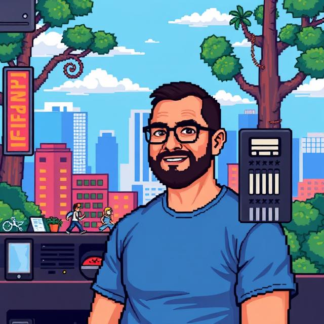

**From the prompt:** 

I am making a habit tracker web app with the added functionality of correlating users routines with mood, 
stress level, confidence, and other emotions or achievements. Can you generate three extended user personas that would be interested in using my app?

[https://chatgpt.com/share/68fe5776-8178-800d-a446-274695016a19](https://chatgpt.com/share/68fe5776-8178-800d-a446-274695016a19)

# User Personas

## 1️⃣ Alex Kim — The Overworked Young Professional

- **Age:** 28  
- **Occupation:** Marketing Analyst  
- **Location:** New York City  
- **Tech Comfort Level:** High

### Profile & Lifestyle

Ambitious and career-driven but frequently overwhelmed by deadlines and constant notifications. Struggles to maintain a healthy routine and often sacrifices self-care for productivity.

### Goals & Motivations

- Regain control over daily routines
- Optimize work-life balance
- Understand how habits affect stress and performance
- Use data to create sustainable lifestyle changes

### Pain Points

- Burnout and inconsistent sleep
- Generic habit trackers without emotional context
- Needs personalized insights vs. generic streaks

### How the App Helps

- Reveals correlations between habits and stress/mood
- Provides data-backed insights and visualizations
- Encourages small, sustainable improvements
- Integrates with health data for deeper insights

---

## 2️⃣ Priya Nair — The Student on a Self-Improvement Journey

- **Age:** 21  
- **Occupation:** University Student (Psychology Major)  
- **Location:** Toronto, Canada  
- **Tech Comfort Level:** Very high

### Profile & Lifestyle

Actively exploring mindfulness and emotional wellness. Balances university, social life, and part-time work. Loves tracking personal growth but struggles to stay consistent using multiple apps.

### Goals & Motivations

- Build consistent study and self-care habits
- Understand how emotional fluctuations influence motivation
- Track self-confidence and stress during academic cycles
- Visualize personal development

### Pain Points

- Hard to quantify emotional progress
- Easily overwhelmed by chaotic schedules
- Needs structure without pressure or judgment

### How the App Helps

- Connects mood data to routines over time
- Encourages gentle accountability and reflection
- Supports self-discovery with prompts and insights
- Builds a growth narrative through data and journaling

---

## 3️⃣ David Morales — The Midlife Rebalancer

- **Age:** 45  
- **Occupation:** Small Business Owner  
- **Location:** Austin, Texas  
- **Tech Comfort Level:** Moderate

### Profile & Lifestyle

After years focused on his business, David wants to prioritize his health and emotional wellbeing. Values tools that are simple, practical, and non-overwhelming.

### Goals & Motivations

- Manage stress and maintain a balanced lifestyle
- Improve confidence and reconnect with personal goals
- Establish sustainable health and emotional habits
- Track progress in a simple, meaningful way

### Pain Points

- Overly complex apps feel stressful and cluttered
- Disconnect from emotions (“just powers through”)
- Needs low-friction check-ins that offer real clarity

### How the App Helps

- Simplified habit and mood tracking
- Calm, friendly insights to guide improvements
- Holistic life balance visualizations
- Reinforces emotional awareness without pressure
